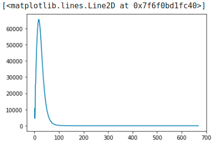
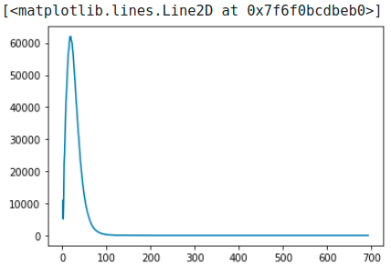

# Notes

Most prefer:
* Pretrained Embeddings: fasttext
* Model: Seq2Seq w/ Attention
* Pretrained Model: mbart - hugging face ([link]())
* Data: EuroParl - hugging face ([link](https://huggingface.co/datasets/europarl_bilingual))
* Metrics: BLEU ([huggingFace](https://huggingface.co/spaces/evaluate-metric/bleu) or [personal code](https://github.com/ymoslem/MT-Evaluation/blob/main/BLEU/compute-bleu.py))

---
Next week:
* Complete training pipeline
* Filtering out suitable sentences (base on word frequency. e.g. most 150k popular words -> only use sentences with those words) (2 <= sent_len < 50)
* Train direct translation (EN -> FR)
* Train translation (EN -> DE -> FR) based on Joint Training for Pivot-based Neural Machine Translation (use their training objective as loss function) (if possible) (expect to be time consuming since using 2 Seq2Seq models)

Last week:
* Try merging systems + continuous system
    * first try direct translate + metric (based level) (focus more on basic **translating machine**)
    * how to make merging system feasible (critical problem that must be solved)
* Try metrics systems
---

TO DO:
* [X] Add Attention
* [ ] Load pretrained word embedding
* [ ] Use pretrained Tokenizer (Spacy) (in dataloader)
* [ ] Initialized all of the LSTM’s parameters with the uniform distribution between -0.08 and 0.08 (check [stackoverflow](https://stackoverflow.com/questions/55276504/different-methods-for-initializing-embedding-layer-weights-in-pytorch) OR [document](https://pytorch.org/docs/stable/nn.init.html_))
---

<details>
<summary>Papers:</summary>

* Papers:
  * [A Comparison of Pivot Methods for Phrase-based Statistical Machine Translation](https://aclanthology.org/N07-1061.pdf) (new)
    * Direct > Phrase-based > Sentence-based
  * [A Teacher-Student Framework for Zero-Resource Neural Machine Translation](https://arxiv.org/pdf/1705.00753.pdf) ([Github](https://github.com/dotaofll/Teacher-Student)) (new)
  * [Sequence to Sequence Learning with Neural Networks](https://proceedings.neurips.cc/paper/2014/file/a14ac55a4f27472c5d894ec1c3c743d2-Paper.pdf)
  * [First Steps towards Multi-Engine Machine Translation](https://aclanthology.org/W05-0828.pdf)
  * [Improving Cross Language Retrieval with Triangulated Translation](http://ccc.inaoep.mx/~villasen/bib/SIGIR2001.pdf)
  * [COMPUTING CONSENSUS TRANSLATION FROM MULTIPLE MACHINE TRANSLATION SYSTEMS](https://citeseerx.ist.psu.edu/document?repid=rep1&type=pdf&doi=c711516db4ef2e9c86234f3dc9d2bff11b3d96f6)
  * [A Comparison of Pivot Methods for Phrase-based Statistical Machine](https://aclanthology.org/N07-1061.pdf)
  * [Enhancing scarce-resource language translation through pivot combinations](https://aclanthology.org/I11-1154.pdf)


  * Pre/Post padding: [Effects of padding on LSTMs and CNNs](https://arxiv.org/pdf/1903.07288.pdf)
  * Triangulated NMT:
    * [Ensemble Triangulation for Statistical Machine Translation](https://aclanthology.org/I13-1029.pdf) (**very similar: FR - EN**)
    * [Machine Translation by Triangulation: Making Effective Use of Multi-Parallel Corpora](https://aclanthology.org/P07-1092.pdf)
    * [Local lexical adaptation in Machine Translation through triangulation: SMT helping SMT](https://aclanthology.org/C10-1027.pdf)
    * [Revisiting Pivot Language Approach for Machine Translation](https://aclanthology.org/P09-1018.pdf)
  * From mail:
      * [Joint Training for Pivot-based Neural Machine Translation](https://www.ijcai.org/proceedings/2017/0555.pdf) --> how to joint 2 models
      * [Pivot-based Transfer Learning for Neural Machine Translation between Non-English Languages](https://arxiv.org/pdf/1909.09524.pdf)
      * [On the Importance of Pivot Language Selection for Statistical Machine Translation](https://aclanthology.org/N09-2056.pdf )
      * [Pivot Based Language Modeling for Improved Neural Domain Adaptation](https://aclanthology.org/N18-1112.pdf)
      * [Pivot Language Approach for Phrase-Based Statistical Machine Translation](https://www.jstor.org/stable/pdf/30219554.pdf)
  * Another approach:
      * Statistical machine translation
      * Neural machine translation


<p align="right"><a href="#notes">[Back to top]</a></p>

</details>

<details>
<summary>2/12/2023</summary>

* <details>
  <summary>Reverse result by dim</summary>

    ```python
      // create torch tensor
      batch_size = 2
      num_layer = 2
      seq_len = 5
      x = torch.rand(batch_size, num_layer, seq_len).type(torch.float32)
      
      // flip (reverse) by dim
      x_2 = np.flip(x.detach().numpy(), axis=2)
    ```
  </details>

<p align="right"><a href="#notes">[Back to top]</a></p>
</details>

<details>
  <summary>2/9/2023:</summary>
* Train on smaller part of dataset --> go larger later

<p align="right"><a href="#notes">[Back to top]</a></p>
</details>

<details>
  <summary>2/7/2023:</summary>

* Modify model (tested on en-fra), visit [My_work_2.ipynb](../My_work_2.ipynb):
  * seq_len=128
  * reverse input seq
  * Best: loss = 2.0569 after 20 epochs on eng-fra.txt (10m30s/ep)
* Dataset:
  * Redo as dict instead of huggingface's dataset type

<p align="right"><a href="#notes">[Back to top]</a></p>
</details>


<details>
  <summary>2/6/2023:</summary>

* Save dataset, etc. w/ Pickle: check [data-note.md](../data/data-note.md)

* Update train_log: added to `utiles/util.py`

* Data EDA:
    * Length: Most sentences have length of < 128 words/sent and >=5words/sent (for 3 pairs En-Fr, De-En, De-Fr w/ pkl files on Drive quan.nh) ----> only use sentences has less than 128 words (128 can be changed based on result of Tokenizer - it can be 100, then pad to 128) ----> reduce computational cost:
        * Result:

        
        
        
        * Code: added to `utils/util.py`

<p align="right"><a href="#notes">[Back to top]</a></p>
</details>

<details>
  <summary>2/5/2023:</summary>

* Tutorial:
    * [Pytorch Seq2Seq Tutorial for Machine Translation](https://www.youtube.com/watch?v=EoGUlvhRYpk) ---> [Pytorch Seq2Seq with Attention for Machine Translation](https://www.youtube.com/watch?v=sQUqQddQtB4)
* Tokenizer:
    * Spacy ([spacy.io](https://spacy.io/usage/models))
    * NLTK ([StackOverflow](https://stackoverflow.com/questions/15111183/what-languages-are-supported-for-nltk-word-tokenize-and-nltk-pos-tag))
* Add embeddings to nn.Embedding ([Medium](https://medium.com/@martinpella/how-to-use-pre-trained-word-embeddings-in-pytorch-71ca59249f76) OR [StackOverflow](https://stackoverflow.com/questions/49710537/pytorch-gensim-how-do-i-load-pre-trained-word-embeddings/49802495#49802495) OR [androidkt.com](https://androidkt.com/pre-train-word-embedding-in-pytorch/))

<p align="right"><a href="#notes">[Back to top]</a></p>
</details>


<details>
  <summary>2/2/2023:</summary>

* Word embeddings:
    * [fasttext: multi-lingual word vectors](https://fasttext.cc/docs/en/crawl-vectors.html) or [Github](https://github.com/facebookresearch/fastText/tree/master)
    * [Fb MUSE: Multilingual Unsupervised and Supervised Embeddings](https://github.com/facebookresearch/MUSE#multilingual-word-embeddings)
* Model:
    * [OpenNMT-py (Github)](https://github.com/OpenNMT/OpenNMT-py) (designed to be research friendly to try out new ideas in translation)
        * -> [Tutorial](https://github.com/ymoslem/OpenNMT-Tutorial)
* Metric: BLEU: [huggingFace](https://huggingface.co/spaces/evaluate-metric/bleu) OR [ymoslem/MT-Evaluation (Github)](https://github.com/ymoslem/MT-Evaluation/blob/main/BLEU/compute-bleu.py)

<p align="right"><a href="#notes">[Back to top]</a></p>
</details>

      

<details>
  <summary>2/1/2023:</summary>

* [simple Seq2Seq w/ Attention (Pytorch)](https://github.com/graykode/nlp-tutorial)
* Choosing languages: Romanic (French, Italian, Spanish, Portuguese, Romanian), Germanic (English, Dutch, German, Danish, Swedish) ([europarl group](https://www.statmt.org/europarl/))

<p align="right"><a href="#notes">[Back to top]</a></p>
</details>


<details>
  <summary>1/30/2023:</summary>

* Dataset: https://huggingface.co/datasets/europarl_bilingual (21 languages) - only has train set, download directly from [Europarl](https://www.statmt.org/europarl/) otherwise. 

* Models:
    * [mbart-large-cc25](https://huggingface.co/facebook/mbart-large-cc25) -> for low-resource languages (e.g. a few thousands to a few millions, up to 15m), using directly or fine-tuning mBART can give better results ([link](https://blog.machinetranslation.io/multilingual-nmt/))
    * [Helsinki-NLP](https://huggingface.co/Helsinki-NLP)
    * List of models by [OpusMT](https://opus.nlpl.eu/Opus-MT/)
    * Most are Transformers, I want to find basic models with RNNs, otherwise, I have to build myself:
        * [Pytorch tutorial Seq2Seq](https://pytorch.org/tutorials/intermediate/seq2seq_translation_tutorial.html#the-seq2seq-model)
        * [Github: pcyin/pytorch_basic_nmt](https://github.com/pcyin/pytorch_basic_nmt)
        * [Github: marumalo/pytorch-seq2seq](https://github.com/marumalo/pytorch-seq2seq)
        * [blog.paperspace.com seq2seq pytorch](https://blog.paperspace.com/seq2seq-translator-pytorch/)
        * [Medium saikrishna4820/lstm-language-translation](https://medium.com/@saikrishna4820/lstm-language-translation-18c076860b23)
        * [TowardsDatScience: how to build an encoder decoder translation model using lstm with python and keras](https://towardsdatascience.com/how-to-build-an-encoder-decoder-translation-model-using-lstm-with-python-and-keras-a31e9d864b9b)
        * Base on this: [Github likarajo/language_translation](https://github.com/likarajo/language_translation)
        * Base on this: [Language Translator (RNN BiDirectional LSTMs and Attention) in Python](https://www.codespeedy.com/language-translator-rnn-bidirectional-lstms-and-attention-in-python/)

<p align="right"><a href="#notes">[Back to top]</a></p>
</details>

<p align="right"><a href="#notes">[Back to top]</a></p>
